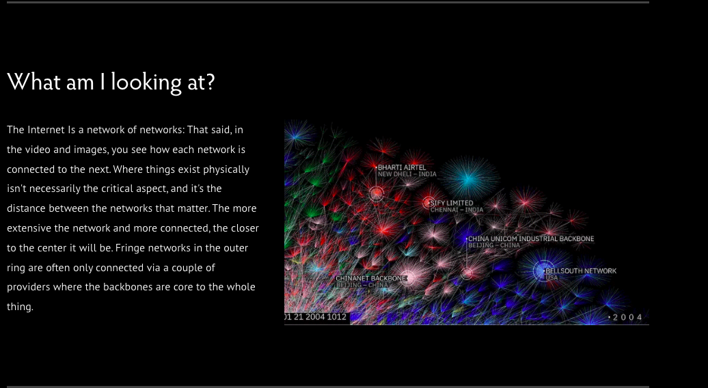

```{r xaringan-themer, include=FALSE, warning=FALSE}
library(xaringanthemer)
style_mono_light(
  base_color = "#042856", 
  header_color = "#7cacd4",
  title_slide_text_color = "#7cacd4",
  link_color = "#0000FF",
  text_color = "#000000",
  background_color = "#FFFFFF",
  header_h1_font_size ="2.00rem"
  )
```


```{r, echo=FALSE, purl=FALSE, message = FALSE}
knitr::opts_chunk$set(comment = "#>", purl = FALSE, fig.showtext = TRUE, retina = 2)
```


```{r xaringan-scribble, echo=FALSE}
xaringanExtra::use_scribble() #activate for the pencil
xaringanExtra::use_xaringan_extra(c("tile_view", "animate_css", "tachyons"))
xaringanExtra::use_panelset() #panel set
```


class: left

# Outline

* What is Network?
 * Examples
* Elements of a graph. 
* The `tidygraph` and `ggraph` packages.  
---

class: center, middle

Internet - the largest engineering project

<iframe width="700" height="500" src="https://www.youtube.com/embed/DdaElt6oP6w" title="YouTube video player" frameborder="0" allow="accelerometer; autoplay; clipboard-write; encrypted-media; gyroscope; picture-in-picture" allowfullscreen></iframe>

[Source](https://www.opte.org/)

---
class: middle, center

```{r echo=FALSE, out.height='100%', out.width='100%'}
  
```

[Source](https://www.opte.org/about)
---

# Networks
- **Network analysis** is a suite of tools/methods developed to understand and analyze graphs in which several **vertices** (nodes) are connected each other through  **edges**.
- With an example from Facebook network, we can consider **vertices** are **users** in the network and **edges** are links denoting **friendships**.


```{r echo=FALSE, out.height='40%', out.width='40%', fig.align='center'}
  
```
---
#### Networks are everywhere!..

- In real life, network analysis helps us to understand complex relationships,
learn about behaviors, preferences, and trends.

---
#### Example: History
```{css echo=FALSE}
.pull-left {
  float: left;
  width: 50%;
}
.pull-right {
  float: right;
  width: 50%;
}
```

.pull-left[
<blockquote class="twitter-tweet"><p lang="en" dir="ltr">The exhibition “From Reformation to the Republic: Master Artists, Artist Students,&quot; which presents the interaction and change between generations through its focus on the relationship between masters and their apprentices, is at Sakıp Sabancı Museum.⁣⁣⁣ <a href="https://t.co/HEN9LhG9Yy">pic.twitter.com/HEN9LhG9Yy</a></p>&mdash; Sakıp Sabancı Müzesi (@SSabanciMuze) <a href="https://twitter.com/SSabanciMuze/status/1404764702618619913?ref_src=twsrc%5Etfw">June 15, 2021</a></blockquote> <script async src="https://platform.twitter.com/widgets.js" charset="utf-8"></script>
]

.pull-right[
<blockquote class="twitter-tweet"><p lang="tr" dir="ltr">“Yüksek Osmanlı Ulemasının Mesleki ve Entelektüel İlişki Ağları ve Gruplaşmaları (1470-1650)” başlıklı projemizi nihayet bitirdik. İzninizle proje konusu hakkında kısa bir bilgi vermeyi ve birkaç örnek paylaşmayı istiyorum. <a href="https://t.co/PFJmfGV5j7">pic.twitter.com/PFJmfGV5j7</a></p>&mdash; Abdurrahman Atçıl (@aatcil) <a href="https://twitter.com/aatcil/status/1307022765363474435?ref_src=twsrc%5Etfw">September 18, 2020</a></blockquote> <script async src="https://platform.twitter.com/widgets.js" charset="utf-8"></script>
]
---
#### Example: Job Connectivity in US

```{r echo=FALSE, out.height='100%', out.width='75%'}
  
```

[Source](https://news.mit.edu/2021/job-connectivity-improves-resiliency-us-cities-0413)

---
#### Example continu'ed
- "Economists, policymakers, city planners, and companies have a strong interest in determining what factors contribute to healthy job markets, including what factors can help promote faster recovery after a shock, such as a major recession or the current Covid-19 pandemic." 
- "Traditional modeling approaches in this realm have treated **workers as narrowly linked to specific jobs**. 
- "In the real world, however, **jobs and sectors are linked**. <span style="color:red">Displaced workers can often transition to another job or sector requiring similar skills.</span>"
- "In this way, **job markets are much like ecosystems, where organisms are linked in a complex web of relationships**.
- "The authors modeled the relationships between jobs in cities across the United States. They predicted that **cities with jobs connected by overlapping skills** and geography would fare better in the face of economic shock than those without such networks."
- "They found that while cities of similar sizes would be affected similarly in the beginning phases of automation shocks, those with **well-connected job networks** would provide **better opportunities** for displaced workers to find other jobs." 
- "This provides a buffer against widespread unemployment, and in some cases even leads to **more jobs** being created in the aftermath of the initial automation shock."
- A city like Burlington, Vermont, where job connectivity is high, would fare much better than Bloomington, Indiana, a similar-sized city where job connectivity is low.
- "The findings of the study suggest that **policymakers should consider job connectivity** when planning for the future of work in their regions, especially where automation is expected to replace large numbers of jobs." 
- "Furthermore, in individual occupations, workers in jobs that are more “embedded” (connected to other jobs) in a region **earn higher wages** than similar workers in areas where those jobs are not as connected."

---
```{css echo=FALSE}
.pull-left {
  float: left;
  width: 50%;
}
.pull-right {
  float: right;
  width: 50%;
}
```

#### Example: Open Syllabus Co-assignment Galaxy
- An interactive visualization of the underlying “co-assignment graph” – the network of relationships among books and articles formed by aggregating over all pairs of titles that appear together in the same courses.

.pull-left[
```{r echo=FALSE, out.height='100%', out.width='100%'}
  
```
]


.pull-right[
```{r echo=FALSE, out.height='100%', out.width='100%'}
  
```
]

[Source 1](https://galaxy.opensyllabus.org/#!viewport/5.5826/21.4688/-7.8283/0.0187)
[Source 2](https://blog.opensyllabus.org/galaxy-v2)

---
#### Example: Covid-19 Knowledge Graph

```{r echo=FALSE, out.height='100%', out.width='80%'}
  
```

[Source](https://covidgraph.org/)

---
```{css echo=FALSE}
.pull-left {
  float: left;
  width: 50%;
}
.pull-right {
  float: right;
  width: 50%;
}
```

#### Example: Covid-19 Bibliometric Analysis

.pull-left[
```{r echo=FALSE, out.height='100%', out.width='100%'}
  
```
]


.pull-right[
```{r echo=FALSE, out.height='100%', out.width='100%'}
  
```
]

[Source](https://www.ncbi.nlm.nih.gov/pmc/articles/PMC7396244/)

---
#### More at: Stanford Large Network Dataset Collection

```{r echo=FALSE, out.height='100%', out.width='100%'}
  
```
[Source](https://snap.stanford.edu/data/index.html)

---
#### Popular Network Analysis Software
- Network analysis and visualization tools are mostly implemented either in a **specific software with a GUI** such as:
   - [Gephi](https://gephi.org/) and
   - [Cytoscape](https://cytoscape.org/)
- or in a **package/library within a programming language** such as:
   - [igraph](https://igraph.org/) (R/Python library),
   - [tidygraph](https://cran.r-project.org/web/packages/tidygraph/index.html) (R library),
   - [ggraph](https://cran.r-project.org/web/packages/ggraph/index.html) (R library), and
   - [NetworkX](https://networkx.org/) (Python library).
---
#### Graph Data Bases
- There also graph databases such as [Neo4j graph data base](https://neo4j.com/) which stores the relationship between data records in a graph format and allows users to do queries with complex connections.

```{r echo=FALSE, out.height='100%', out.width='100%'}
  
```
---
- Some free books to download from web:

.pull-left[
```{r echo=FALSE, out.height='100%', out.width='80%'}
  
```
[Source](https://neo4j.com/graph-data-science-for-dummies/?ref=home)
]

.pull-right[
```{r echo=FALSE, out.height='100%', out.width='80%'}
  
```
[Source](https://neo4j.com/graph-data-science-for-dummies/?ref=home)
]

---
- Research Institutes

```{r echo=FALSE, out.height='100%', out.width='80%', fig.link= "https://www.networkscienceinstitute.org/", fig.align='center'}
  
```

---
- More is available at:
  - [Handbook of Graphs and Networks in People Analytics](https://ona-book.org/gitbook/).
  - [Awesome list curated by François Briatte](https://github.com/briatte/awesome-network-analysis).
  - [Katya Ognyanova's Network Visualization with R](http://kateto.net/network-visualization).
  - [Douglas A. Luke, *A User’s Guide to Network Analysis in R* (2015)](http://www.springer.com/us/book/9783319238821).
  - [Eric D. Kolaczyk and Gábor Csárdi's, Statistical Analysis of Network Data with R (2014)](http://www.springer.com/us/book/9781493909827).

---
# Attributions
- All images used in this slide are taken from the web.
- This lecture note is mainly developed by following sources:
   - [Source 1](http://veronikarock.com/teaching/06_slides.pdf),
   - [Source 2](https://www.jessesadler.com/post/network-analysis-with-r/),
   - [Source 3](http://users.dimi.uniud.it/~massimo.franceschet/ns/syllabus/make/tidygraph/tidygraph.html),
   - [Source 4](https://towardsdatascience.com/notes-on-graph-theory-centrality-measurements-e37d2e49550a), and
   - [Source 5](https://networkingarchives.github.io/blog/2021/04/15/my-network-analysis-workflow/).


