```{r xaringan-themer, include=FALSE, warning=FALSE}
library(xaringanthemer)
style_mono_light(
  base_color = "#042856", 
  header_color = "#7cacd4",
  title_slide_text_color = "#7cacd4",
  link_color = "#0000FF",
  text_color = "#000000",
  background_color = "#FFFFFF",
  header_h1_font_size ="2.00rem"
  )
```


```{r, echo=FALSE, purl=FALSE, message = FALSE}
knitr::opts_chunk$set(comment = "#>", purl = FALSE, fig.showtext = TRUE, retina = 2)
```


```{r xaringan-scribble, echo=FALSE}
xaringanExtra::use_scribble() #activate for the pencil
xaringanExtra::use_xaringan_extra(c("tile_view", "animate_css", "tachyons"))
xaringanExtra::use_panelset() #panel set
```


class: left

# Outline

* What is Network?
 * Examples
* Elements of a graph. 
* The `tidygraph` and `ggraph` packages.  

---
# Graph Elements
- A graph $\mathcal{G}$ consists of two sets:
  - The first set $\mathcal{V}$
is known as the **vertex set** or **node set**, and consists of vertices.
  - The second set  $\mathcal{E}$
is known as the **edge set**, and consists of pairs of elements of  $\mathcal{V}$.
- Given that a graph is made up of these two sets, we will often notate our graph as  
$\mathcal{G} = (\mathcal{V}, \mathcal{E})$.
- If two vertices appear as a pair in  $\mathcal{E}$, then those vertices are said to be **adjacent** or **connected vertices**.  

---
# Example
- Following figure is a diagram of a graph  $\mathcal{G}_{work}$
with **four vertices** representing four people. 
- An **edge connects two vertices** if and only if those two people have worked together.

```{r echo=FALSE, out.height='40%', out.width='40%', fig.align='center'}
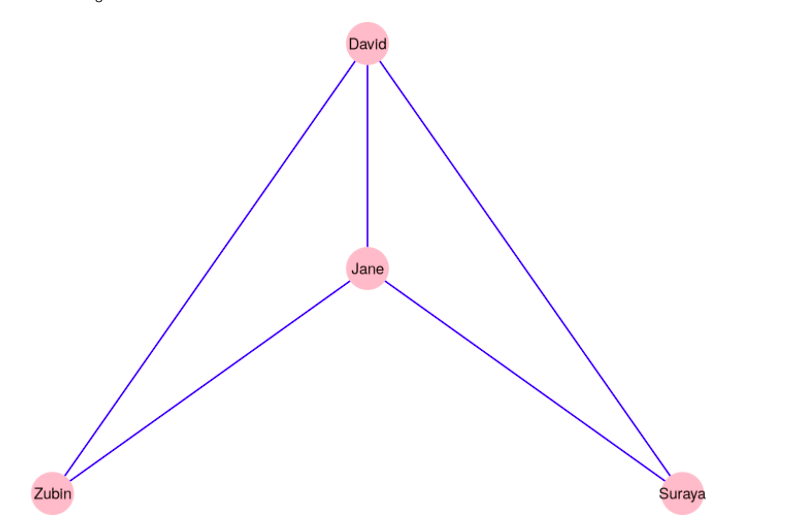  
```

- The vertex set $\mathcal{V}$ for the graph  $\mathcal{G}_{work}$ is:

\begin{equation}
\mathcal{V} = \{David, Suraya, Jane, Zubin\}
\end{equation}

- The edge set $\mathcal{E}$ can be denoted in different ways. One approach is to use set notation:

\begin{equation}
\mathcal{E} = \{ \{David, Zubin\}, \{David, Suraya\}, \{David, Jane\}, \{Jane, Zubin\}, \{Jane, Suraya\} \}
\end{equation}

---
- Note that if David has worked with Zubin, then we can automatically say that Zubin has worked with David. 
- Therefore, we do not need for **direction in the edges** of $\mathcal{G}_{work}$.  
- The order of the nodes in each pair in the edge set $\mathcal{E}$ is not relevant. 
- We call such a graph as an **undirected graph**.
- In an **undirected graph**, following two sets are the same:

\begin{equation}
\mathcal{E} = \{ \{David, Zubin\}, \{David, Suraya\}, \{David, Jane\}, \{Jane, Zubin\}, \{Jane, Suraya\} \}.
\end{equation}

\begin{equation}
\mathcal{E} = \{ \{Zubin, David\}, \{Suraya, Suraya\}, \{Jane, David\}, \{Zubin, Jane\}, \{Suraya, Jane\} \}.
\end{equation}

- Alternatively, we can also use:

\begin{equation}
\mathcal{E} = \{ \{David \leftrightarrow Zubin\}, \{David \leftrightarrow Suraya\}, \{David \leftrightarrow Jane\}, \{Jane \leftrightarrow Zubin\}, \{Jane \leftrightarrow Suraya\} \}.
\end{equation}

- As long as the vertex and edge sets contains all of the information required to construct the graph, it does not matter how you notate them.

---
- A graph where **direction is important** is called a **directed graph**.
- As an example, let’s consider a graph $\mathcal{G}_{manage}$ with the same vertex set of four people but where an edge exists between two people if and only if the first person is the manager of the second person, as in the following figure:

```{r echo=FALSE, out.height='40%', out.width='40%', fig.align='center'}
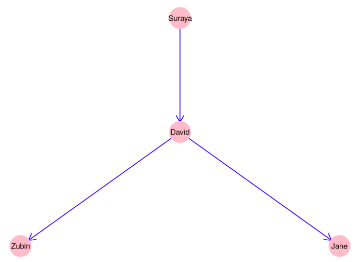  
```

- Since the direction matters in this example, we may wish to notate the edge set $\mathcal{E}$
for $\mathcal{G}_{manage}$ as follows:

\begin{equation}
\mathcal{E} = \{ \{Sureaya \rightarrow David\}, \{David \rightarrow Zubin\}, \{David \rightarrow Jane\}\}.
\end{equation}

---
- The graphs $\mathcal{G}_{work}$ and  $\mathcal{G}_{manage}$
 are called **simple graphs**. 
- A simple graph cannot have **more than one edge** between any two vertices, and cannot have any **loop** edges from one vertex back to itself.
- A **multigraph** is a graph where **multiple edges** can occur between the **same two vertices**. Usually this occurs because the edges are defining different kinds of relationships. 
- Travel routes are common examples of multigraphs, where each edge represents a different carrier.

```{r echo=FALSE, out.height='60%', out.width='60%', fig.align='center'}
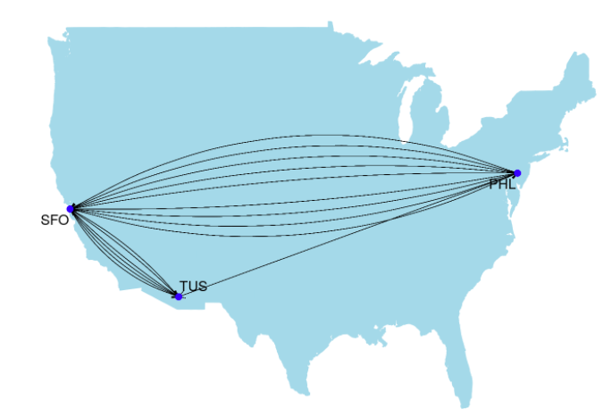  
```

---
#### Adjacency matrix
- While **networks** are visually displayed as **graphs**, most network analysis software/packages need data to be prepared as **adjacency matrices**.
- An adjacency matrix is a **square matrix** in which the **column and row names** are the vertices of the network, and where the $(i,j)$-th entry of the matrix represents the number of edges from vertex $i$ to vertex $j$.
- Within the adjacency matrix a **1 indicates** that there is a **connection between the vertices**, and a **0 indicates no connection**. 
- As an example, using our graph  $\mathcal{G}_{work}$  the adjacency matrix would look like this:

```{r echo=FALSE, out.height='50%', out.width='50%', fig.align='center'}
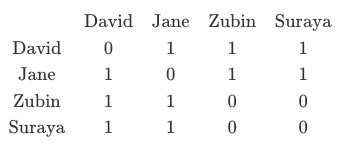  
```

---
#### How to create Network objects in R? 

- Unfortunately, adjacency matrices implement a very **different data structure** than the `tidyverse workflow` that we have used so far. 
- Hopefully, we can create **network objects** from an **edge-list data frame**, which do fit in the `tidyverse workflow`.
- An **edge list** is a **data frame** that contains a **minimum of two columns**:
  - One column of nodes (vertices) that are the **source of a connection**, also labelled as **from** and 
  - Another column of nodes that are the **target of the connection**, also labelled as **to**.
- For example, the edge list for graph $\mathcal{G}_{work}$ would like as follows:

```{r echo=FALSE, out.height='60%', out.width='60%', fig.align='center'}
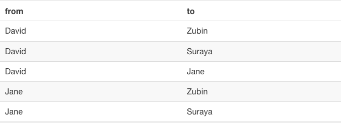    
```

---
- An edge list can also contain **additional columns** that describe **attributes of the edges** such as a magnitude aspect for an edge. 
- If the edges have a **magnitude attribute** the graph is considered **weighted**.
- The **nodes** in the data are identified by **unique IDs**. 
---
- Let's create the minimal edge list for graph $\mathcal{G}_{work}$ with the `tibble()` function.
- We will name the source column as “from” and the target column as “to”.

```{r, warning=FALSE, message=FALSE}
library(tidyverse)
gwork_edgelist <- tibble(
  from = c("David", "David", "David", "Jane", "Jane"),
  to = c("Zubin", "Suraya", "Jane", "Zubin", "Suraya")
)
gwork_edgelist
```

---
- How can we know that how many nodes (vertices) we have?

```{r}
###Create the unique node list
source <- gwork_edgelist  %>%
            distinct(from) %>%
            rename(label = from) #rename it by label

target <- gwork_edgelist %>%
             distinct(to) %>%
             rename(label = to)  #rename it by label

#number of nodes
nodes <- full_join(source, target, by = "label")  #removes repeated entries
dim(nodes)[1]
```

---
class: center, middle

# Centrality measures
---
#### Centrality degree
- The **degree centrality** or **valence** of a vertex _v_  is the number of edges connected to _v_. 
- **Degree centrality** is a measure of **immediate connection in a network** and could be interpreted as **immediate reach in a social network**. Its precise interpretation depends strongly on the nature of the connection.  

```{r echo=FALSE, out.height='50%', out.width='50%', fig.align='center'}
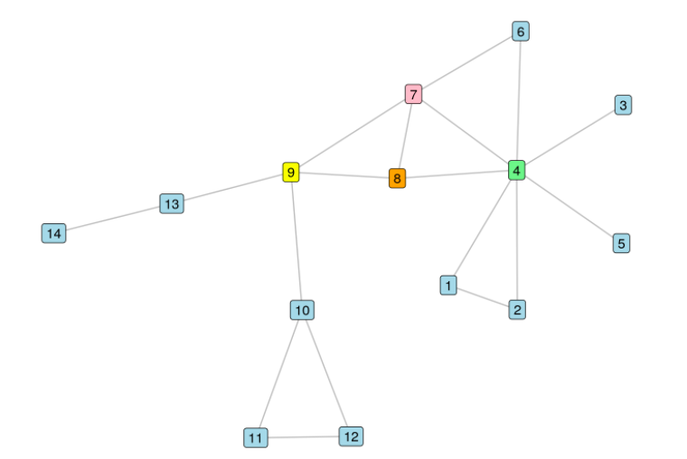    
```

- Vertex 4 has the highest degree centrality.
---
#### Closeness centrality
- The closeness centrality of a vertex _v_ in a connected graph is the **inverse of the sum of the distances** from  _v_ to all other vertices.
- Inverting this distance means that **lower total distances** will generate **higher closeness centrality**.  
- **Closeness centrality** is a measure of **how efficiently** the entire graph can be traversed from a given vertex. This is particularly valuable in the study of **information flow**. In social networks, information shared by those with high closeness centrality will likely reach the entire network more efficiently. 

```{r echo=FALSE, out.height='50%', out.width='50%', fig.align='center'}
    
```

- Vertex 7 has the highest closeness centrality.
---
#### Betwenness centrality
- The **betweenness centrality** of a vertex  _v_
is calculated by taking each pair of other vertices _x_ and _y_, calculating the number of shortest paths between _x_ and _y_ that go through  _v_ dividing by the total number of shortest paths between  _x_ and _y_ then summing over all such pairs of vertices in the graph.
- **Betweenness centrality** is a measure of how important a given vertex is in connecting other pairs of vertices in the graph.
- In people networks, individuals with higher betweenness centrality can be regarded as playing important roles in ensuring overall connectivity of the network, and if they are removed from the network the risks of overall disconnection are higher. This has strong applications in studying the effects of departures from organizations.

```{r echo=FALSE, out.height='30%', out.width='30%', fig.align='center'}
    
```

- Vertex 9 has the highest betweenness centrality.
---
#### Which measure are they estimating?

```{r echo=FALSE, out.height='70%', out.width='70%', fig.align='center', fig.link="https://research.fb.com/blog/2016/02/three-and-a-half-degrees-of-separation/"}
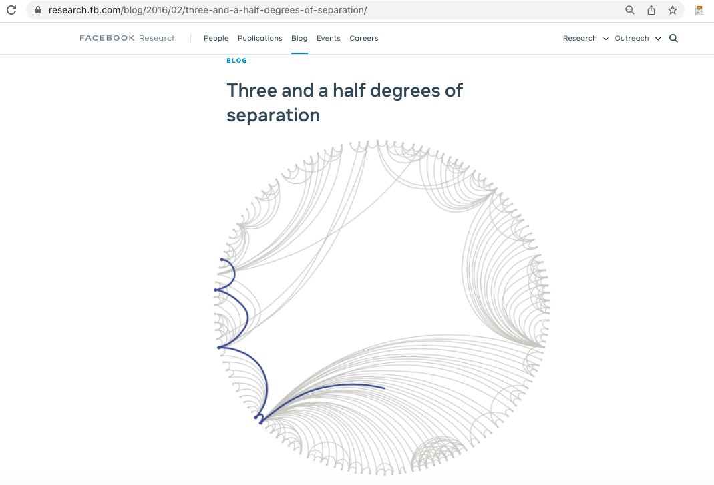  
```

- **Side note:** "We used [_Flajolet-Martin’s math_](https://en.wikipedia.org/wiki/Flajolet%E2%80%93Martin_algorithm) to estimate the number of unique friends for each degree of separation."

---
#### The igraph software/package
- The [igraph](https://igraph.org/) is a collection of network analysis tools for visualizing and summarizing graphs. 
- It has front-ends for `R`, `Python`, `Mathematica`, and `C/C++`.
- For example, the `R` package to use [igraph](https://igraph.org/) software is
the [igraph](https://igraph.org/r/) package.
- However, its data structure is not compatible with `tidyverse ecosytem`. 

<br>

```{r echo=FALSE, out.height='50%', out.width='50%', fig.align='right'}
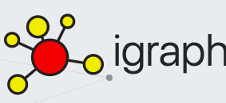  
```
---
class: middle, center

.pull-left[
```{r echo=FALSE, out.height='100%', out.width='60%'}
knitr::include_graphics('logo/tidygraph.png')  
```
]


.pull-right[
```{r echo=FALSE, out.height='100%', out.width='60%'}
knitr::include_graphics('logo/ggraph.png')  
```
]

---
#### tidygraph and ggraph packages

- The [tidygraph](https://tidygraph.data-imaginist.com/) and [ggraph](https://www.data-imaginist.com/2017/ggraph-introduction-layouts/) packages leverage the power of [igraph](https://igraph.org/r/) in a manner consistent with the `tidyverse ecosystem`. 
- Of course, to be able to use the functionalities of `tidygraph` and `ggraph` packages, we have to install and then load the packages: 

```{r, warning=F, message=F}
## Download and install the packages
## install.packages(c("tidygraph","ggraph"))
## load the packages
library(tidygraph)
library(ggraph)
```

---
#### tidygraph package
- The [tidygraph](https://tidygraph.data-imaginist.com/) provides an tidy API for graph/network manipulation. While network data itself is not tidy, it can be envisioned as **two tidy tables**, one for **node data** and one for **edge data**. 
- It basically provides a way to **switch between** the edge and node **tables** and accepts `dplyr` functions for manipulating them.
- Most commonly used functions in the `tidygraph` package are:

|Function                     |Description                                                                         | 
|-----------------------------|------------------------------------------------------------------------------------|
|`as_tbl_graph()`             |Create a data structure from edge list for tidy graph manipulation.                                |
|`tbl_graph()`                |Create a data structure from edge list for tidy graph manipulation when node list is also available. |
|`activate()`                 |Defines whether to manipulate node or edge table at the moment.  Takes either `nodes` or `edges` keyword.|
|`centrality_*()` |  Measures the importance of node in the network with different centrality measures. Used inside `dplyr::mutate()`.|
|`bind_edges()` | Append edges to the graph.  New data must contain valid **from** and **to** columns.|
|`bind_nodes()` | Append nodes to the graph. | 
|`bind_graphs()` | Combine multiple graphs in the same graph structure resulting in each original graph to become a component in the returned graph.|

---
#### Example: Bitcoin Alpha trust weighted signed network

- **Dataset information:** This is who-trusts-whom network of people who trade using Bitcoin on a platform called Bitcoin Alpha. Since Bitcoin users are **anonymous**, there is a need to maintain a record of users' reputation to prevent transactions with fraudulent and risky users. Members of Bitcoin Alpha rate other members in a scale of -10 (total distrust) to +10 (total trust) in steps of 1. This is the first explicit weighted signed directed network available for research.

- The data set is said to be available at https://snap.stanford.edu/data/soc-sign-bitcoin-alpha.html.
- However, I was able to download the data from the following source: https://cs.stanford.edu/~srijan/wsn/.

```{r echo=FALSE, out.height='100%', out.width='90%'}
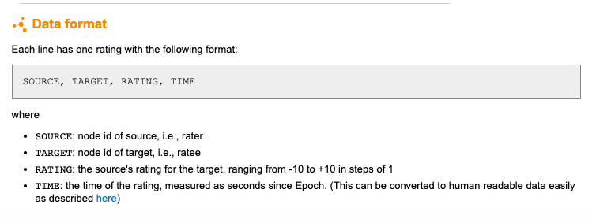  
```

---
```{r echo=FALSE, out.height='100%', out.width='50%'}
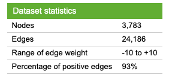  
```

---

- We should first import the bitcoin data.

```{r, message=F, warning=F}
#import data with read_csv
library(tidyverse)
#there is no column names.
#first label the columns.
bitcoin <- read_csv("data/BTCAlphaNET.csv", col_names = c("Source", "Target", "Rating"))
head(bitcoin, 10)
```

---
- Check the the number of edges and nodes in the data set, respectively.

```{r}
#check the number of edges
dim(bitcoin)
```


```{r}
#check the number of distinct sources
#3286
bitcoin %>%  
  distinct(Source) %>%
  count()
```

```{r}
#check the number of distinct targets
#3754
bitcoin %>%  
  distinct(Target) %>%
  count()           
```

---
- Now create unique node list to determine the number of nodes.

```{r}
### Create the unique node list
#3286
sources <- bitcoin %>%
            distinct(Source) %>%
            rename(label = Source)

#3754
targets <- bitcoin %>%
            distinct(Target) %>%
            rename(label = Target)

# 3783 
nodes <- full_join(sources, targets, by = "label")
dim(nodes)
```

---
#### Prepare an edge list
- Edge list is a simple data frame with **two columns**, with a ‘from’ and a ‘to’, representing the connections between two nodes, one per row. 
- We can add an **attribute** called weight to the edge list, which is simply another column.

```{r}
#Now create edge list.
#note that bitcoin data already came in this format.
edges <- bitcoin %>%
          rename(from = Source, to = Target, weight = Rating)
#View(edges)
```

---
#### Turn the edge list into a graph object: tbl_graph()
- The function `as_tbl_graph()` in `tidygraph` package turns the edge list into a graph object with `tbl_graph` class. 

```{r}
library(tidygraph)
bitcoin_tbl_graph <- edges %>% 
                      as_tbl_graph()
                     
class(bitcoin_tbl_graph)
```

---
- The returned `tbl_graph` object consists of **two tables**, one for the nodes and one for the edges. 

```{r}
bitcoin_tbl_graph
```

- The `tbl_graph` class allows us to use `tidyverse ecosystem` functions to manipulate the `graph` objects along with the `igraph` package functions. 
- This means we can create a network and then use a range of standard data analysis functions on it as needed.

---
- We can access each of the tables using the function `activate(nodes)` or `activate(edges)`. The active table has the word `(active)` next to it.

- Activate nodes data:

```{r}
bitcoin_tbl_graph %>% 
  activate(nodes)
```

---
- The current **active data table** can always be extracted as a **tibble** using `as_tibble()`:

```{r}
bitcoin_tbl_graph %>% 
  activate(nodes) %>% 
  as_tibble()
```

---
- Activate edges data:

```{r}
bitcoin_tbl_graph %>% 
  activate(edges)
```

---
- Get edges data:
```{r}
bitcoin_tbl_graph %>% 
  activate(edges) %>% 
  as_tibble()
```

---
- The `tidygraph` allows us to perform centrality calculations on the `tbl_graph` object for use inside `dplyr::mutate()`. 
- The function `centrality_degree()` calculates the degree of every node and returns a numeric vector giving the centrality measure of each node.
- For example to calculate the degree of every node in the bitcoin example:

```{r}
#sort the nodes by their degree (in descending form)
node_degree <- bitcoin_tbl_graph %>% 
                activate(nodes) %>% 
                mutate(degree = centrality_degree()) %>% 
                as_tibble() %>% 
                arrange(-degree)

#View(node_degree) 
```

- The more connections a node have the more it is more central and highly connected, thus it has an **influence on the graph**.

---
- Find the most reliable people on this network!..

```{r, eval=F}
bitcoin_tbl_graph %>% 
  activate(edges) %>% 
  filter(weight == 1) %>% #find who gets 1
  as_tibble() %>%
  count(to) %>%  #count how many 1's received that person
  View()
```

---
-  If we want to filter just edges from ID 34, we can use the `filter()` function from `dplyr` and create a new graph object with `as_tbl_graph()`:

```{r}
trader_34 <- bitcoin_tbl_graph %>% 
             activate(edges) %>% 
             filter(from == 34) %>% 
             as_tbl_graph() 
#View(trader_34)
```

---
- Calculate the centrality of betwenness in the bitcoin network.

```{r}
node_betweennes <- bitcoin_tbl_graph %>% 
                   activate(nodes) %>% 
                   mutate(betweenness = centrality_betweenness()) %>% 
                   as_tibble() %>% 
                   arrange(-betweenness)
#View(node_betwenness)
```

---
#### Expanding graphs: Binding edges
- The function `bind_edges()` append edges to an existing graph. 
- Trader "1" did not trade with traders "22" and "23". But, let's assume
that they have actually traded, but, we forgot to record it.

```{r}
edge2 <- tibble(from = c(1, 1), to = c(22, 23), weight= c(0.8,0.8))
```

```{r, eval=F}
bitcoin_tbl_graph %>% 
  activate(edges) %>% 
  bind_edges(edge2) %>% 
  filter(from == 1) %>% 
  as_tibble() %>% 
  View()
```

---
#### Newtwork visualisation with ggraph  
- The [ggraph](https://github.com/thomasp85/ggraph) package provides a grammar for building **network visualizations**.
- The `ggraph` package uses the same language as `ggplot2` so that making it easier to carry over basic `ggplot` skills to the creation of network plots.
- It also adds some special `geoms` to the basic set of `ggplot` `geoms` that are specifically designed for networks.
- In all network graphs there are _three main aspects_ for a `ggraph` plot: 
  - [nodes](https://www.data-imaginist.com/2017/ggraph-introduction-nodes/), 
  - [edges](https://www.data-imaginist.com/2017/ggraph-introduction-edges/), and
  - [layouts](https://www.data-imaginist.com/2017/ggraph-introduction-layouts/). 

---
- To create a network diagram, first we need to use the function `ggraph()` on our `tbl_graph` object, 
then add the special ggraph based `geom_*()` such as:

|Function           |Description                                                             | 
|-------------------|------------------------------------------------------------------------|
|`ggraph()`         | Takes the data to be used for the graph and the **type of layout** desired. |        
|`geom_node_*()`    | Draw nodes. Many of these are direct translations of ggplot2.          |             
|`geom_edge_*()`    | Draw edges.                                                            |
|`theme_graph()`    | Special ggplot theme that provides better defaults for network graphs. |  
    
---
- Let’s see what a basic `ggraph()` plot looks like. The plot begins with `ggraph()` and the data. 
- The structure of the `ggraph()` is similar to that of `ggplot` with the separate layers added with the + sign.
- Then we add basic node and edge geoms such as `geom_node_point()` and  `geom_edge_link()`, respectively, with the + sign.
- No arguments are necessary within the edge and node geoms, because they take the information from the data provided in `ggraph()`.
- But, the functions `geom_node_point()` and  `geom_edge_link()` take aesthetics, just like regular `ggplot geoms`.


---
.panelset[

.panel[.panel-name[Code]

```{r, eval=F}
library(ggraph)
bitcoin_tbl_graph %>% 
   activate(nodes) %>% 
   mutate(degree = centrality_degree()) %>% 
   filter(60 < degree  & degree < 80) %>% #filter traders with whose degree is between 60 and 80.
   #activate(nodes) %>%  #returns a tbl_graph with 21 nodes and 68 edges
   ggraph(layout = "auto") +  #default one
   geom_node_point(shape = 1, size = 2, colour = "blue") + #?geom_node_point for more aesthetics
   geom_edge_link(edge_colour="red") +  #?geom_edge_link for more aesthetics
   #This geom draws edges in the simplest way - as straight lines between the start and end nodes.
   theme_graph() +#if i do not use then background color will be gray.
   labs(title = "Bitcoin Alpha trust Network")
```  
]

.panel[.panel-name[Output]
```{r, echo=F, warning=F, message=F}
library(ggraph)
bitcoin_tbl_graph %>% 
   activate(nodes) %>% 
   mutate(degree = centrality_degree()) %>% 
   filter(60 < degree  & degree < 80) %>% #filter traders with whose degree is between 60 and 80.
   #activate(nodes) %>%  #returns a tbl_graph with 21 nodes and 68 edges
   ggraph(layout = "auto") +  #default one
   geom_node_point(shape = 1, size = 2, colour = "blue") + #?geom_node_point for more aesthetics
   geom_edge_link(edge_colour="red") +  #?geom_edge_link for more aesthetics
   #This geom draws edges in the simplest way - as straight lines between the start and end nodes.
   theme_graph() + #if i do not use then background color will be gray.
   labs(title = "Bitcoin Alpha trust Network")
```  
]
]
  
---

.panelset[

.panel[.panel-name[Code]

- Add `geom_node_text()` to add text labels to your network. In a larger network, 
it can be helpful to only show labels belonging to the most-connected nodes.  

```{r, eval=F}
bitcoin_tbl_graph %>% 
   activate(nodes) %>% 
   mutate(degree = centrality_degree()) %>% 
   filter(60 < degree  & degree < 80) %>%
   #activate(nodes) %>% 
   ggraph(layout = "auto") +  #default one
   geom_edge_link(edge_colour="red") +
   geom_node_point(aes(size = as.factor(degree))) +  #resize nodes with respect to degree
   #geom_node_text(aes(label = name), repel = TRUE) +
   geom_node_text(aes(label = if_else(degree > 75, name, NULL)), repel = TRUE) +  #name colum comes from nodes table
   #set to TRUE will use the repel functionality provided by 
   #the ggrepel package to avoid overlapping text.
   theme_graph() +
   labs(title = "Bitcoin Alpha trust Network")
```

- The a `repel = TRUE` argument ensures that the labels do not overlap with the nodes.
]

.panel[.panel-name[Output]
```{r, echo=F, warning=F, message=F}
bitcoin_tbl_graph %>% 
   activate(nodes) %>% 
   mutate(degree = centrality_degree()) %>% 
   filter(60 < degree  & degree < 80) %>%
   #activate(nodes) %>% 
   ggraph(layout = "auto") +  #default one
   geom_edge_link(edge_colour="red") +
   geom_node_point(aes(size = as.factor(degree))) +  #resize nodes with respect to degree
   #geom_node_text(aes(label = name), repel = TRUE) +
   geom_node_text(aes(label = if_else(degree > 75, name, NULL)), repel = TRUE) +  #name colum comes from nodes table
   #set to TRUE will use the repel functionality provided by 
   #the ggrepel package to avoid overlapping text.
   theme_graph() +
   labs(title = "Bitcoin Alpha trust Network")
```
]
]

---
-  A **layout** is the vertical and horizontal placement of nodes when plotting a particular graph structure. 
- More is available at https://www.data-imaginist.com/2017/ggraph-introduction-layouts/.

.panelset[

.panel[.panel-name[Code]

```{r, eval=F}
bitcoin_tbl_graph %>% 
   activate(nodes) %>% 
   mutate(degree = centrality_degree()) %>% 
   filter(60 < degree  & degree < 80) %>%  #note in between(degree,60,80): end-points are included
   ggraph(layout = 'dendrogram') + 
   geom_node_text(aes(label = name), repel = TRUE) +
   geom_node_point(shape = 1, size = 2, colour = "darkblue") + 
   geom_edge_diagonal(colour = 'red') +
   theme_graph()
```
]

.panel[.panel-name[Output]
```{r, echo=F, warning=F, message=F}
bitcoin_tbl_graph %>% 
   activate(nodes) %>% 
   mutate(degree = centrality_degree()) %>% 
   filter(60 < degree  & degree < 80) %>%  #note in between(degree,60,80): end-points are included
   ggraph(layout = 'dendrogram') + 
   geom_node_text(aes(label = name), repel = TRUE) +
   geom_node_point(shape = 1, size = 2, colour = "darkblue") + 
   geom_edge_diagonal(colour = 'red') +
   theme_graph()
```

]
]

---
- For **dynamic network visualization**:

```{r echo=FALSE, out.height='100%', out.width='80%', fig.link="http://christophergandrud.github.io/networkD3/", fig.align='center'}
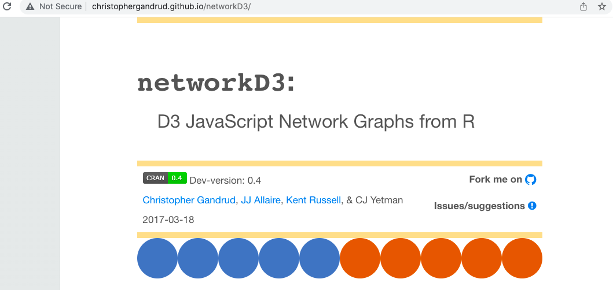  
```


---

class: center, middle

```{r echo=FALSE, out.height='100%', out.width='80%'}
  
```


---
- More is available at:
  - [Handbook of Graphs and Networks in People Analytics](https://ona-book.org/gitbook/).
  - [Awesome list curated by François Briatte](https://github.com/briatte/awesome-network-analysis).
  - [Katya Ognyanova's Network Visualization with R](http://kateto.net/network-visualization).
  - [Douglas A. Luke, *A User’s Guide to Network Analysis in R* (2015)](http://www.springer.com/us/book/9783319238821).
  - [Eric D. Kolaczyk and Gábor Csárdi's, Statistical Analysis of Network Data with R (2014)](http://www.springer.com/us/book/9781493909827).

---
# Attributions
- All images used in this slide are taken from the web.
- This lecture note is mainly developed by following sources:
   - [Source 1](http://veronikarock.com/teaching/06_slides.pdf),
   - [Source 2](https://www.jessesadler.com/post/network-analysis-with-r/),
   - [Source 3](http://users.dimi.uniud.it/~massimo.franceschet/ns/syllabus/make/tidygraph/tidygraph.html),
   - [Source 4](https://towardsdatascience.com/notes-on-graph-theory-centrality-measurements-e37d2e49550a), and
   - [Source 5](https://networkingarchives.github.io/blog/2021/04/15/my-network-analysis-workflow/).


